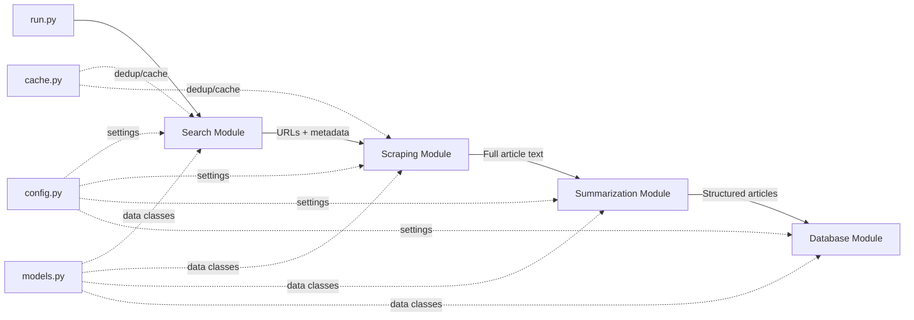

# Renewable Energy News Research Agent — Implementation Plan

## Goal

Build a production-ready Python research agent that autonomously collects, scrapes, summarizes, and stores the latest weekly news about renewable energy (solar, wind, hybrid, storage, policy, innovation) using Tavily Search API, newspaper4k for scraping, and Google Gemini via LangChain for summarization.

## Architecture Overview



## Project Structure

```
news-agents/
├── src/
│   ├── __init__.py
│   ├── config.py           # Configuration & env vars
│   ├── models.py           # Pydantic data models
│   ├── search.py           # Tavily search module
│   ├── scraper.py          # Article scraping (newspaper4k + BeautifulSoup fallback)
│   ├── summarizer.py       # LLM summarization via LangChain + Gemini
│   ├── database.py         # SQLite database module
│   ├── cache.py            # Simple file-based caching & deduplication
│   └── agent.py            # Orchestrator that ties all modules together
├── run.py                  # Example run script (entry point)
├── requirements.txt
├── .env.example
└── README.md
```

---

## Proposed Changes

### Configuration & Models

#### [NEW] [.env.example](file:///c:/Users/aashi/Documents/news-agents/.env.example)
- Template for required API keys: `TAVILY_API_KEY`, `GOOGLE_API_KEY`
- Optional settings: `DB_PATH`, `CACHE_DIR`, `LOG_LEVEL`

#### [NEW] [src/config.py](file:///c:/Users/aashi/Documents/news-agents/src/config.py)
- Load environment variables via `python-dotenv`
- Define constants: search queries, trusted sources list, max results, date range (7 days)
- Trusted sources list: Reuters, Bloomberg, The Guardian, CleanTechnica, PV Magazine, Renewable Energy World, etc.

#### [NEW] [src/models.py](file:///c:/Users/aashi/Documents/news-agents/src/models.py)
- Pydantic models:
  - `SearchResult` — raw search result from Tavily
  - `ScrapedArticle` — full article content after scraping
  - `ProcessedArticle` — final output with summary, tags, sentiment
- All models include validation (URL format, date parsing, content length)

---

### Search Module

#### [NEW] [src/search.py](file:///c:/Users/aashi/Documents/news-agents/src/search.py)
- Use `tavily-python` SDK directly (more control than LangChain wrapper)
- Execute multiple search queries in parallel using `asyncio`:
  1. `"latest renewable energy news this week"`
  2. `"solar energy industry updates last 7 days"`
  3. `"wind energy policy news recent"`
  4. `"energy storage battery technology news this week"`
  5. `"renewable energy policy regulation news"`
  6. `"clean energy innovation technology breakthroughs"`
- Tavily parameters: `search_depth="advanced"`, `time_range="week"`, `max_results=10`, `include_raw_content=True`
- Deduplicate results by URL and fuzzy title matching (using `difflib.SequenceMatcher`, threshold 0.85)
- Filter to trusted sources where possible
- Target: ≥10 unique articles across all queries

---

### Scraping Module

#### [NEW] [src/scraper.py](file:///c:/Users/aashi/Documents/news-agents/src/scraper.py)
- Primary: `newspaper4k` (`newspaper.article(url)`) for full text, title, publish date, top image
- Fallback: If Tavily already returned `raw_content`, use that directly
- Secondary fallback: `BeautifulSoup` + `httpx` for pages that newspaper4k can't parse
- Async scraping with `asyncio` + `httpx` for concurrent fetching
- Extract: `title`, `text`, `publish_date`, `top_image`, `authors`
- Validate published date is within last 7 days
- Clean HTML artifacts from text content
- Timeout: 15 seconds per article

---

### Summarization Module

#### [NEW] [src/summarizer.py](file:///c:/Users/aashi/Documents/news-agents/src/summarizer.py)
- Use `langchain-google-genai` with `ChatGoogleGenerativeAI` (model: `gemini-2.0-flash`)
- LangChain prompt template for summarization:
  - System prompt enforcing factual, neutral, 100-150 word summaries
  - Explicit instruction to NOT hallucinate or add information not in the source
- Structured output using Pydantic model for response:
  - `content_summary` (str, 100-150 words)
  - `tags` (list: solar/wind/storage/policy/innovation/hybrid)
  - `sentiment` (positive/neutral/negative)
- Async batch processing with rate limiting
- Temperature: 0.1 (low creativity, high fidelity)

---

### Database Module

#### [NEW] [src/database.py](file:///c:/Users/aashi/Documents/news-agents/src/database.py)
- SQLite via `aiosqlite` for async operations
- Schema:
  ```sql
  CREATE TABLE IF NOT EXISTS articles (
      id INTEGER PRIMARY KEY AUTOINCREMENT,
      title TEXT NOT NULL,
      content_summary TEXT NOT NULL,
      link TEXT UNIQUE NOT NULL,
      images_links TEXT,  -- JSON array
      published_date TEXT,
      created_at TEXT NOT NULL,
      tags TEXT,           -- JSON array (bonus)
      sentiment TEXT       -- bonus
  );
  ```
- Functions: `init_db()`, `insert_article()`, `insert_articles_batch()`, `get_all_articles()`, `article_exists(link)`
- Upsert logic: skip if article with same URL already exists

---

### Cache Module

#### [NEW] [src/cache.py](file:///c:/Users/aashi/Documents/news-agents/src/cache.py)
- File-based JSON cache in `.cache/` directory
- Cache scraped article content keyed by URL hash
- TTL: 24 hours
- Functions: `get_cached(url)`, `set_cache(url, content)`, `is_cached(url)`
- Prevents re-scraping the same URL across runs

---

### Orchestrator & Entry Point

#### [NEW] [src/agent.py](file:///c:/Users/aashi/Documents/news-agents/src/agent.py)
- Main orchestration pipeline:
  1. Search → collect candidate URLs
  2. Deduplicate
  3. Scrape full content (check cache first)
  4. Summarize via LLM
  5. Validate output
  6. Store in database
  7. Export as JSON
- Comprehensive logging at each step
- Error handling: skip individual failed articles, continue pipeline
- Return final list of `ProcessedArticle` dicts

#### [NEW] [run.py](file:///c:/Users/aashi/Documents/news-agents/run.py)
- CLI entry point using `asyncio.run()`
- Pretty-print results to console
- Save JSON output to `output/results.json`
- Print summary stats (articles found, processed, stored)

---

### Supporting Files

#### [NEW] [requirements.txt](file:///c:/Users/aashi/Documents/news-agents/requirements.txt)
```
tavily-python>=0.5.0
langchain>=0.3.0
langchain-core>=0.3.0
langchain-google-genai>=2.0.0
newspaper4k>=0.9.0
beautifulsoup4>=4.12.0
httpx>=0.27.0
aiosqlite>=0.20.0
pydantic>=2.0.0
python-dotenv>=1.0.0
```

#### [NEW] [README.md](file:///c:/Users/aashi/Documents/news-agents/README.md)
- Project overview, setup instructions, usage examples, architecture diagram

---

## Open Questions

> [!IMPORTANT]
> **API Keys**: Do you already have Tavily and Google Gemini API keys ready, or should I add detailed setup instructions for obtaining them?

> [!NOTE]
> **Database Choice**: I'm using SQLite for simplicity and zero-config. Would you prefer PostgreSQL or another database instead?

> [!NOTE]
> **LLM Model**: I plan to use `gemini-2.0-flash` for fast, cost-effective summarization. Would you prefer `gemini-2.5-pro` for higher quality (slower, more expensive)?

---

## Verification Plan

### Automated Tests
1. Run `python run.py` end-to-end and verify:
   - ≥10 unique articles collected
   - No duplicate URLs in output
   - All summaries are 100-150 words
   - All published dates are within last 7 days
   - Valid JSON output written to `output/results.json`
   - Database populated with matching records
2. Verify error handling by testing with invalid URLs

### Manual Verification
- Review sample output JSON for quality
- Verify summaries are factual and match source content
- Check that tags and sentiment labels are reasonable
